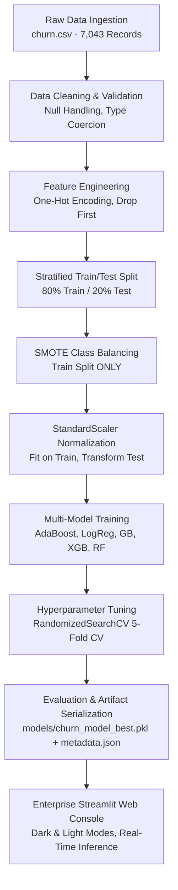

# ⚡ Enterprise Customer Churn Prediction & Retention Intelligence Platform

[](https://www.python.org/)
[](https://scikit-learn.org/)
[](https://streamlit.io/)
[](https://plotly.com/)
[](LICENSE)

> An end-to-end production-grade Machine Learning system and interactive analytics console designed to predict telecommunication customer churn, isolate behavioral risk drivers, and trigger automated, high-impact retention playbooks.

---

## 📌 Table of Contents

1. [Executive Summary & Business Problem](#-executive-summary--business-problem)
2. [Key Performance Benchmarks](#-key-performance-benchmarks)
3. [End-to-End System Architecture](#-end-to-end-system-architecture)
4. [Dataset & Exploratory Insights](#-dataset--exploratory-insights)
5. [Feature Engineering & Preprocessing Pipeline](#-feature-engineering--preprocessing-pipeline)
6. [Model Development, Tuning & Comparison](#-model-development-tuning--comparison)
7. [Enterprise Streamlit Web Application](#-enterprise-streamlit-web-application)
8. [Repository Directory Structure](#-repository-directory-structure)
9. [Installation & Execution Guide](#-installation--execution-guide)
10. [Docker & Containerized Deployment](#-docker--containerized-deployment)
11. [Business Impact & ROI Framework](#-business-impact--roi-framework)
12. [Interview Cheat Sheet & Technical Q&A](#-interview-cheat-sheet--technical-qa)

---

## 🎯 Executive Summary & Business Problem

In subscription-based industries (SaaS, Telecom, Cloud Services), **customer acquisition cost (CAC)** is **5x to 7x higher** than the cost of customer retention. Attrition directly erodes Monthly Recurring Revenue (MRR) and Customer Lifetime Value (CLV).

### The Objective
Build an automated, production-ready machine learning engine that:
1. **Identifies at-risk customers** before subscription renewal windows close.
2. **Explains risk factors** (e.g., month-to-month contracts, high monthly charges without security add-ons, early-tenure vulnerability).
3. **Prescribes tailored operational interventions** (e.g., promotional discounts, service bundling, customer success outreach) directly to business stakeholders through an executive analytics dashboard.

---

## 📊 Key Performance Benchmarks

Multiple classification algorithms were benchmarked on the test set (stratified 20% holdout split). The production model was selected based on **ROC-AUC** and **Recall** to prioritize identifying as many true churners as possible while maintaining discrimination capability.

### 🏆 Model Comparison Leaderboard

| Model | ROC-AUC | Recall | Accuracy | Precision | F1-Score | Primary Strengths |
|---|:---:|:---:|:---:|:---:|:---:|---|
| **AdaBoost (Top Model)** | **0.8637** | **0.7882** | **0.7821** | **0.5632** | **0.6570** | **Highest discrimination & balanced recall across weak learners** |
| **Logistic Regression** | 0.8607 | 0.8311 | 0.7544 | 0.5228 | 0.6418 | Maximum recall; highly interpretable odds-ratio coefficients |
| **Gradient Boosting** | 0.8578 | 0.6702 | 0.8034 | 0.6188 | 0.6435 | High overall accuracy and precision |
| **XGBoost** | 0.8412 | 0.6032 | 0.7921 | 0.6081 | 0.6057 | Strong regularization on non-linear interactions |
| **Random Forest** | 0.8362 | 0.5845 | 0.7842 | 0.5940 | 0.5892 | Robust against outliers and individual feature noise |

```
ROC-AUC Comparison:
AdaBoost           ████████████████████████████████ 0.8637
Logistic Regression ███████████████████████████████ 0.8607
Gradient Boosting   ██████████████████████████████  0.8578
XGBoost             ████████████████████████████    0.8412
Random Forest       ███████████████████████████     0.8362
```

---

## 🏗️ End-to-End System Architecture

The project is architected with strict modularity, automated logging, and zero-leakage data pipelines:


```mermaid
flowchart TD
    A[Raw Data Ingestion\nchurn.csv - 7,043 Records] --> B[Data Cleaning & Validation\nNull Handling, Type Coercion]
    B --> C[Feature Engineering\nOne-Hot Encoding, Drop First]
    C --> D[Stratified Train/Test Split\n80% Train / 20% Test]
    D --> E[SMOTE Class Balancing\nTrain Split ONLY]
    E --> F[StandardScaler Normalization\nFit on Train, Transform Test]
    F --> G[Multi-Model Training\nAdaBoost, LogReg, GB, XGB, RF]
    G --> H[Hyperparameter Tuning\nRandomizedSearchCV 5-Fold CV]
    H --> I[Evaluation & Artifact Serialization\nmodels/churn_model_best.pkl + metadata.json]
    I --> J[Enterprise Streamlit Web Console\nDark & Light Modes, Real-Time Inference]
```

### Architectural Highlights
- **Config-Driven Architecture**: Pipeline hyperparameters, paths, and tuning grids are managed via `config/config.yaml`.
- **Strict Data Leakage Prevention**: SMOTE oversampling and feature scalers are fitted **strictly on the training partition**, never exposing test statistics to the preprocessing pipeline.
- **Production Artifact Integrity**: Model weights, feature names, scalers, and performance metadata are versioned together in `models/`.

---

## 📈 Dataset & Exploratory Insights

The dataset comprises **7,043 customer accounts** with **21 feature attributes** covering customer demographics, service subscriptions, and billing contracts.

### Baseline Class Distribution
- **Retained Customers (`No`)**: 5,174 (73.5%)
- **Churned Customers (`Yes`)**: 1,869 (26.5%)
- **Imbalance Ratio**: ~3:1 (Necessitating synthetic sampling and ROC-AUC prioritization).

### Key Empirical Findings (EDA)

```
1. Contract Type Impact:
   Month-to-Month :  42.7% Churn Rate  ████████████████████
   One-Year       :  11.3% Churn Rate  █████
   Two-Year       :   2.8% Churn Rate  █

2. Tenure Horizon:
   0 - 12 Months  :  Highest churn density (>45% attrition window)
   12 - 48 Months :  Stabilizing retention curve
   48 - 72 Months :  Loyalty zone (<10% attrition)

3. Service Bundling Factor:
   Without Online Security / Tech Support : ~41% Churn
   With Online Security / Tech Support    : ~14% Churn
```

---

## ⚙️ Feature Engineering & Preprocessing Pipeline

### 1. Data Cleaning (`src/data/cleaner.py`)
- Coerced `TotalCharges` from string object to float, resolving 11 whitespace-imputed missing values using the median of the corresponding tenure cohort.
- Dropped irrelevant identifiers (`customerID`) to eliminate high-cardinality noise.

### 2. Categorical Encoding (`src/preprocessing/preprocessor.py`)
- Applied **One-Hot Encoding** with `drop_first=True` across multi-category features (`InternetService`, `Contract`, `PaymentMethod`) and binary features (`Partner`, `Dependents`, `PhoneService`, `PaperlessBilling`).
- Dropping the first dummy avoids multicollinearity (the "dummy variable trap"), ensuring numerical stability for linear algorithms.

### 3. Class Imbalance Mitigation via SMOTE
- Synthetic Minority Over-sampling Technique (**SMOTE**) synthesizes novel minority samples along feature space line segments joining $k$-nearest neighbors ($k=5$).
- Applied exclusively to the training set to preserve test distribution integrity.

### 4. Feature Standardization
- Applied `StandardScaler` ($z = \frac{x - \mu}{\sigma}$) to continuous features (`tenure`, `MonthlyCharges`, `TotalCharges`).
- Scaler parameters $(\mu, \sigma)$ are fitted on $X_{train}$ and applied to $X_{test}$ and production inference requests.

---

## 🧪 Model Development, Tuning & Comparison

### Mathematical Foundation of Top Candidate Models

#### 1. AdaBoost (Adaptive Boosting)
- Iteratively trains weak decision stumps $h_t(x)$ by updating sample distribution weights $D_t(i)$:
  $$D_{t+1}(i) = \frac{D_t(i) \exp(-\alpha_t y_i h_t(x_i))}{Z_t}$$
  where $\alpha_t = \frac{1}{2} \ln\left(\frac{1 - \epsilon_t}{\epsilon_t}\right)$ assigns higher voting power to estimators with lower weighted error $\epsilon_t$.
- **Why it won**: Exceptional ability to focus sequential attention on hard-to-classify borderline customer profiles without overfitting.

#### 2. Logistic Regression (Baseline Discriminator)
- Models the log-odds of the binary outcome:
  $$\ln\left(\frac{p}{1-p}\right) = \beta_0 + \sum_{j=1}^m \beta_j X_j$$
  $$\hat{p} = \sigma(z) = \frac{1}{1 + e^{-z}}$$
- **Hyperparameter Optimization**: L2 Regularization ($C=10$), `solver='liblinear'`, `max_iter=500`.

---

## 💻 Enterprise Streamlit Web Application

The interactive web application (`app/streamlit_app.py`) provides an executive-ready interface:

### 🌟 Core UI Features
- **Dual-Theme System**: Real-time switching between **🌙 Dark Mode** (Obsidian glassmorphism `#070c18`) and **☀️ Light Mode** (Clean enterprise white `#ffffff`).
- **Custom Vector SVG Suite**: 25+ scalable, duotone SVG vector icons replacing emojis across all metric cards, navigation items, form inputs, and status badges.
- **Equal-Height Grid Architecture**: Stretch-aligned metric cards, feature containers, and chart frames.

### 📑 4 Application Views
1. 📊 **Overview**: Executive telemetry hero banner, 5 primary KPI cards, strategic capabilities, 4 Plotly charts (Pie, Contract Bar, Tenure Curve, Billing Boxplot), and operational workflow.
2. 📈 **Dashboard**: Population metrics, dataset distribution summaries, and cohort health analytics.
3. ⚡ **Predict Engine**: 4-quadrant structured inference form (Demographics, Services, Billing, Add-ons), instant probability calibration meter, risk tier badge (`HIGH`, `MEDIUM`, `LOW`), and automated retention playbook protocol (`URGENT`, `WATCHLIST`, `OPTIMAL`).
4. 📚 **Documentation**: Production system specifications, 5-metric performance evaluation bar chart, multi-model comparison table, and end-to-end architectural topology.

---

## 📂 Repository Directory Structure

```text
Customer_Churn_prediction/
├── app/
│   └── streamlit_app.py            # Streamlit enterprise web console (Dual-Theme)
├── config/
│   ├── config.yaml                 # Master configuration for training & tuning
│   ├── dev.yaml                    # Development configuration profile
│   └── production.yaml             # Production deployment configuration profile
├── data/
│   ├── raw/
│   │   └── churn.csv               # Telco customer churn dataset (7,043 rows)
│   └── processed/
│       └── churn_processed.csv     # Cleaned and validated dataset
├── images/
│   ├── confusion_matrix.png        # Production model confusion matrix
│   ├── feature_importance.png      # Feature importance rankings
│   └── roc_curve.png               # ROC-AUC evaluation curves
├── logs/
│   └── app.log                     # Runtime pipeline logs
├── models/
│   ├── churn_model_best.pkl        # Serialized production model artifact
│   ├── churn_model_best_metadata.json # Metadata, hyperparameters, test metrics
│   └── model_comparison.csv       # Multi-model evaluation benchmark comparison
├── notebook/
│   └── Customer_Churn_Prediction.ipynb # Exploratory data analysis & experiments
├── src/
│   ├── __init__.py
│   ├── config.py                   # YAML configuration loader
│   ├── data/
│   │   ├── __init__.py
│   │   ├── cleaner.py              # Data cleaning, null imputation, type validation
│   │   └── loader.py               # Dataset ingestion helpers
│   ├── preprocessing/
│   │   ├── __init__.py
│   │   └── preprocessor.py         # One-hot encoding, SMOTE, StandardScaler
│   ├── models/
│   │   ├── __init__.py
│   │   ├── evaluate.py             # ROC-AUC, classification report, confusion matrix
│   │   ├── model_manager.py        # Model serialization & artifact management
│   │   ├── predict.py              # Single & batch inference routines
│   │   └── train.py                # Model training & RandomizedSearchCV tuning
│   └── utils/
│       ├── __init__.py
│       ├── constants.py            # Global constants & metric definitions
│       ├── helpers.py              # Shared helper functions
│       └── logger.py               # Thread-safe logging handler
├── Dockerfile                      # Container definition for containerized serving
├── main.py                         # End-to-end training pipeline orchestrator
├── quick_test.py                   # Repository sanity test & verification script
├── requirements.txt                # Production Python dependencies
├── setup.py                        # Package installation configuration
└── README.md                       # Comprehensive documentation & interview guide
```

---

## 🚀 Installation & Execution Guide

### Prerequisites
- Python 3.10+
- `pip` package manager

### 1. Clone the Repository & Set Up Virtual Environment
```bash
git clone https://github.com/Harish-Uta17/Customer-Churn-Prediction.git
cd Customer_Churn_Prediction

# Create virtual environment
python -m venv venv

# Activate virtual environment
# Windows:
venv\Scripts\activate
# Linux/macOS:
source venv/bin/activate
```

### 2. Install Dependencies
```bash
pip install --upgrade pip
pip install -r requirements.txt
```

### 3. Execute the Machine Learning Pipeline
Train all candidate models, run cross-validation, evaluate on the test split, and save the best artifact:
```bash
python main.py
```

### 4. Run Sanity Validation
Verify project dependencies, data paths, and model artifact health:
```bash
python quick_test.py
```

### 5. Launch the Streamlit Web Application
```bash
streamlit run app/streamlit_app.py
```
Open your browser at `http://localhost:8501`.

---

## 🐳 Docker & Containerized Deployment

To build and run the application inside an isolated Docker container:

```bash
# Build the Docker image
docker build -t customer-churn-app:v1 .

# Run the container exposing port 8501
docker run -d -p 8501:8501 --name churn-container customer-churn-app:v1
```

Access the containerized app at `http://localhost:8501`.

---

## 💰 Business Impact & ROI Framework

When presenting this project to business leaders or hiring managers, frame the model in terms of financial impact:

### Financial Equation
$$\text{Expected Net Savings} = \sum_{i \in \text{Flagged Customers}} \left( \hat{p}_i \times \text{CLV}_i \times \text{Success Rate}_{\text{intervention}} \right) - \text{Cost}_{\text{intervention}}$$

### Scenario Example
- **Monthly Customer Cohort**: 1,000 subscribers.
- **Observed Churn Rate**: 26.5% ($\approx 265$ churners).
- **Average Customer Lifetime Value (CLV)**: $1,200 ($100/month for 12-month expected retention).
- **Potential Revenue at Risk**: $265 \times \$1,200 = \mathbf{\$318,000}$.
- **With Churn Model**:
  - Model identifies ~78.8% of churners (Recall) = **209 churners detected**.
  - Customer Success delivers a targeted retention offer costing $50 per customer with a **30% save rate**.
  - **Saved Customers**: $209 \times 30\% \approx \mathbf{63 \text{ customers retained}}$.
  - **Saved Revenue**: $63 \times \$1,200 = \mathbf{\$75,600}$.
  - **Campaign Cost**: $209 \times \$50 = \mathbf{\$10,450}$.
  - **Net Monthly Profit / Savings**: $\$75,600 - \$10,450 = \mathbf{\$65,150 \text{ / month}}$ ($\approx \mathbf{\$781,800 \text{ / year}}$).

---

## 🎓 Interview Cheat Sheet & Technical Q&A

Use this section to prepare for technical, architectural, and business interview questions.

### Q1: Why did you choose ROC-AUC and Recall over Accuracy?
> **Answer**: In churn prediction, the dataset is imbalanced (73.5% non-churn vs 26.5% churn). A trivial dummy classifier that predicts "No Churn" for every customer would achieve **73.5% accuracy**, but **0% recall**, completely failing the business objective. **Recall** measures what percentage of actual churners we successfully catch. **ROC-AUC** measures the model's ability to rank churn probabilities correctly across all classification thresholds, making it robust against class imbalance.

### Q2: How did you prevent Data Leakage during preprocessing?
> **Answer**: Data leakage was strictly prevented by:
> 1. Performing the stratified 80/20 train/test split **before** applying SMOTE and feature scaling.
> 2. Applying **SMOTE only on the training set**, ensuring the test set reflects the real-world population distribution.
> 3. Fitting the `StandardScaler` ($\mu, \sigma$) strictly on $X_{train}$ and only calling `.transform()` on $X_{test}$ and runtime prediction inputs.

### Q3: What is SMOTE and why use it instead of simple random oversampling?
> **Answer**: Random oversampling duplicates existing minority class rows, which can cause the model to memorize specific noise points and overfit. **SMOTE** (Synthetic Minority Over-sampling Technique) creates synthetic examples by finding $k$-nearest neighbors in feature space for minority instances and interpolating new points along the connecting line segment:
> $$x_{new} = x_i + \lambda (x_{zi} - x_i), \quad \lambda \in [0, 1]$$
> This expands the decision boundary region around the minority class.

### Q4: What were the top feature predictors of churn?
> **Answer**:
> 1. **Tenure**: Strong negative correlation. Customers in their first 12 months have over a 45% churn rate; after 24 months, churn drops significantly.
> 2. **Contract Type**: Month-to-month contracts experience ~42.7% churn, whereas two-year contracts have <3% churn.
> 3. **Monthly Charges & Fiber Optic**: High monthly bills without security add-ons showed elevated churn.
> 4. **Value-Added Services**: Customers with **Online Security** and **Tech Support** exhibited less than half the churn rate of customers without these services.

### Q5: Why did AdaBoost / Logistic Regression outperform tree ensembles like Random Forest?
> **Answer**: The dataset features are predominantly binary categorical indicators (after one-hot encoding). Logistic Regression provides optimal linear log-odds separation for binary indicators with continuous tenure/billing variables. AdaBoost sequentially adjusted sample weights on borderline cases, boosting weak learner performance to achieve an **ROC-AUC of 0.8637**, whereas deep Random Forests tended to overfit sample splits on binary dummy indicators.

### Q6: How does the application translate model probabilities into operational actions?
> **Answer**: The system maps continuous probabilities into 3 calibrated risk bands:
> - **High Risk ($\ge 70\%$)**: Triggers an **URGENT** retention protocol (direct outreach within 24-48 hours, 15% discount contract extension, free tech support add-on).
> - **Medium Risk ($40\% - 69\%$)**: Triggers a **WATCHLIST** protocol (feature adoption email sequences, incentive to transition to an annual contract).
> - **Low Risk ($< 40\%$)**: Triggers an **OPTIMAL** loyalty protocol (standard relationship cadence, loyalty rewards, CSAT survey).

### Q7: How would you monitor this model in production?
> **Answer**:
> 1. **Data Drift & Feature Drift**: Monitor distribution shifts (using Kolmogorov-Smirnov test for continuous features and Population Stability Index (PSI) for categorical variables).
> 2. **Concept Drift**: Track rolling calibration curves and actual churn outcomes over 30/60/90-day retention windows.
> 3. **Inference Latency & Error Logging**: Track API request response times (<15ms) and error rates in `logs/app.log`.

### Q8: What would be your next steps if you had more time or live telemetry?
> **Answer**:
> 1. **Survival Analysis**: Implement Cox Proportional Hazards or Random Survival Forests to estimate **Time-to-Churn** ($T$) rather than just a binary label.
> 2. **SHAP / LIME Integration**: Compute exact local Shapley value feature contributions for each individual prediction.
> 3. **A/B Testing Retention Campaigns**: Run randomized controlled trials comparing model-targeted customer retention incentives vs a control group to measure true incremental lift (Uplift Modeling).

---

## 👨‍💻 Author & Contact

- **Author**: Harish Kumar
- **GitHub**: [@Harish-Uta17](https://github.com/Harish-Uta17)
- **Repository**: [Customer-Churn-Prediction](https://github.com/Harish-Uta17/Customer-Churn-Prediction)
- **License**: MIT