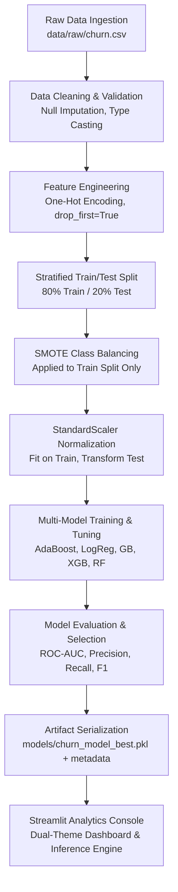

# ⚡ Customer Churn Prediction & Retention Intelligence Platform

[](https://www.python.org/)
[](https://scikit-learn.org/)
[](https://streamlit.io/)
[](https://plotly.com/)
[](LICENSE)

> A production-ready Machine Learning system and interactive analytics console for telecommunication customer churn prediction, behavioral risk analysis, and automated retention playbooks.

---

## 📌 Table of Contents

1. [Project Overview](#-project-overview)
2. [Business Problem & Motivation](#-business-problem--motivation)
3. [Key Performance & Evaluation Benchmarks](#-key-performance--evaluation-benchmarks)
4. [System Architecture & Dataflow](#-system-architecture--dataflow)
5. [Dataset Description & Insights](#-dataset-description--insights)
6. [Data Preprocessing & Feature Engineering](#-data-preprocessing--feature-engineering)
7. [Machine Learning Models & Algorithms](#-machine-learning-models--algorithms)
8. [Interactive Streamlit Web Console](#-interactive-streamlit-web-console)
9. [Project Directory Structure](#-project-directory-structure)
10. [Setup & Execution Guide](#-setup--execution-guide)
11. [Docker Containerization](#-docker-containerization)

---

## 🎯 Project Overview

This project provides an end-to-end Machine Learning pipeline and an enterprise web dashboard for identifying subscription customers who are at risk of churning. It ingests customer demographic, contract, and service telemetry, processes the data through a zero-leakage feature pipeline, evaluates multiple classification models, and serves real-time calibrated churn risk predictions with actionable retention recommendations.

### Core Capabilities
- **Automated Data Pipeline**: Robust cleaning, missing value handling, one-hot encoding, and feature scaling.
- **Class Imbalance Resolution**: Synthetic Minority Over-sampling Technique (SMOTE) applied strictly to training data to handle ~3:1 class imbalance.
- **Multi-Model Benchmark**: Evaluates and compares 5 classification algorithms (AdaBoost, Logistic Regression, Gradient Boosting, XGBoost, Random Forest).
- **Interactive Web Interface**: Streamlit dashboard with a dual-theme design system (Light and Dark modes), custom SVG vector icons, real-time risk diagnostic meters, and operational playbooks.

---

## 💼 Business Problem & Motivation

In subscription-based industries like telecom and SaaS, acquiring a new customer costs 5 to 7 times more than retaining an existing one. Customer attrition directly decreases Monthly Recurring Revenue (MRR) and lowers Customer Lifetime Value (CLV).

### Business Goals
1. **Early Attrition Detection**: Identify at-risk subscribers weeks before contract termination.
2. **Actionable Explanations**: Surface key churn drivers (e.g., month-to-month contracts, high monthly charges, lack of tech support/security add-ons).
3. **Automated Interventions**: Provide Customer Success and account teams with targeted retention playbooks based on calculated risk tiers (High, Medium, Low).

---

## 📊 Key Performance & Evaluation Benchmarks

The models were evaluated on a stratified 20% holdout test set across multiple metrics. **ROC-AUC** and **Recall** were prioritized as the primary evaluation criteria to ensure maximum identification of true churners while preserving probability ranking capability.

### 🏆 Model Comparison Leaderboard

| Model | ROC-AUC | Recall | Accuracy | Precision | F1-Score | Key Characteristics |
|---|:---:|:---:|:---:|:---:|:---:|---|
| **AdaBoost (Production)** | **0.8637** | **0.7882** | **0.7821** | **0.5632** | **0.6570** | **Highest ranking power; balanced precision and recall** |
| **Logistic Regression** | 0.8607 | 0.8311 | 0.7544 | 0.5228 | 0.6418 | Highest recall; highly interpretable feature coefficients |
| **Gradient Boosting** | 0.8578 | 0.6702 | 0.8034 | 0.6188 | 0.6435 | High overall accuracy and precision |
| **XGBoost** | 0.8412 | 0.6032 | 0.7921 | 0.6081 | 0.6057 | Effective regularization on complex interactions |
| **Random Forest** | 0.8362 | 0.5845 | 0.7842 | 0.5940 | 0.5892 | Robust ensemble with low sensitivity to noise |

```
ROC-AUC Comparison:
AdaBoost            ████████████████████████████████ 0.8637
Logistic Regression  ███████████████████████████████ 0.8607
Gradient Boosting    ██████████████████████████████  0.8578
XGBoost              ████████████████████████████    0.8412
Random Forest        ███████████████████████████     0.8362
```

---

## 🏗️ System Architecture & Dataflow

The system follows a modular architecture where each stage has a dedicated responsibility:


```mermaid
flowchart TD
    A[Raw Data Ingestion\ndata/raw/churn.csv] --> B[Data Cleaning & Validation\nNull Imputation, Type Casting]
    B --> C[Feature Engineering\nOne-Hot Encoding, drop_first=True]
    C --> D[Stratified Train/Test Split\n80% Train / 20% Test]
    D --> E[SMOTE Class Balancing\nApplied to Train Split Only]
    E --> F[StandardScaler Normalization\nFit on Train, Transform Test]
    F --> G[Multi-Model Training & Tuning\nAdaBoost, LogReg, GB, XGB, RF]
    G --> H[Model Evaluation & Selection\nROC-AUC, Precision, Recall, F1]
    H --> I[Artifact Serialization\nmodels/churn_model_best.pkl + metadata]
    I --> J[Streamlit Analytics Console\nDual-Theme Dashboard & Inference Engine]
```

### Pipeline Flow
1. **Config Loading**: Reads configuration parameters from `config/config.yaml`.
2. **Ingestion & Validation**: Loads raw dataset, verifies data types, and checks schema consistency.
3. **Cleaning**: Handles missing values in `TotalCharges` using cohort-based median imputation.
4. **Encoding**: Converts categorical variables to numerical features using one-hot encoding (`drop_first=True`).
5. **Stratified Splitting**: Splits data into 80% training and 20% testing sets while preserving the target distribution.
6. **Class Balancing**: Applies SMOTE oversampling exclusively to the training set.
7. **Feature Standardization**: Fits `StandardScaler` on training features and transforms both train and test partitions.
8. **Model Training & Tuning**: Trains candidate algorithms and optimizes hyperparameters using `RandomizedSearchCV` with 5-fold cross-validation.
9. **Artifact Export**: Serializes the best-performing model, scaler, feature list, and metadata into `models/`.
10. **Web Serving**: The Streamlit application loads the serialized artifacts to deliver real-time inference and exploratory analytics.

---

## 📈 Dataset Description & Insights

The dataset comprises **7,043 customer accounts** with **21 feature attributes** detailing demographics, subscribed services, account contracts, and billing information.

### Dataset Overview
- **Total Records**: 7,043
- **Retained (No Churn)**: 5,174 (73.5%)
- **Churned (Yes)**: 1,869 (26.5%)
- **Target Variable**: `Churn` (Binary: `Yes` / `No`)

### Feature Categories

| Category | Features |
|---|---|
| **Demographics** | `gender`, `SeniorCitizen`, `Partner`, `Dependents` |
| **Connectivity & Services** | `PhoneService`, `MultipleLines`, `InternetService`, `OnlineSecurity`, `OnlineBackup`, `DeviceProtection`, `TechSupport`, `StreamingTV`, `StreamingMovies` |
| **Account & Billing** | `tenure`, `Contract`, `PaperlessBilling`, `PaymentMethod`, `MonthlyCharges`, `TotalCharges` |

### Key Exploratory Findings
- **Contract Impact**: Subscribers on **month-to-month contracts** exhibit a **~42.7% churn rate**, compared to **11.3%** for one-year contracts and **2.8%** for two-year contracts.
- **Tenure Vulnerability**: Customer churn is heavily concentrated in the **first 12 months** of tenure. Accounts that surpass 24 months show significantly higher retention stability.
- **Service Bundling Effect**: Customers with **Online Security** and **Tech Support** add-ons have an attrition rate of **~14%**, compared to **~41%** for customers without these services.
- **Billing Impact**: Customers with fiber optic service and higher monthly charges without bundled support features represent the highest-risk churn cohort.

---

## ⚙️ Data Preprocessing & Feature Engineering

### 1. Cleaning & Validation (`src/data/cleaner.py`)
- `TotalCharges` contained 11 whitespace-padded missing entries for new customers with `tenure = 0`. These were imputed with cohort median values and converted from object to float.
- Dropped the unique identifier `customerID` to prevent high-cardinality noise.

### 2. Categorical Encoding (`src/preprocessing/preprocessor.py`)
- Applied **One-Hot Encoding** with `drop_first=True` across nominal features (`Contract`, `InternetService`, `PaymentMethod`, etc.) to prevent multicollinearity (the dummy variable trap).
- Converted all boolean indicator columns to integer type (`0` / `1`).

### 3. Class Imbalance Mitigation (SMOTE)
- Mitigated the 73.5% / 26.5% class imbalance using **SMOTE** (Synthetic Minority Over-sampling Technique).
- Synthetic instances were generated by interpolating between minority instances and their 5 nearest neighbors in feature space.
- **Zero-Leakage Guarantee**: SMOTE was applied **only** to the training partition ($X_{train}, y_{train}$), ensuring the test set ($X_{test}, y_{test}$) remained unmodified and representative of real-world distributions.

### 4. Feature Standardization
- Applied `StandardScaler` to continuous numerical columns (`tenure`, `MonthlyCharges`, `TotalCharges`).
- Scaler parameters $(\mu, \sigma)$ were fitted strictly on the training set and applied to the test set and production inference payloads.

---

## 🧪 Machine Learning Models & Algorithms

The pipeline trains and evaluates five algorithms:

### 1. AdaBoost Classifier (Production Model)
- Sequentially trains an ensemble of decision stumps, iteratively adjusting sample weights to emphasize previously misclassified instances.
- **Selected Hyperparameters**: `n_estimators=100`, `learning_rate=1.0`, `random_state=42`.
- **Strengths**: Best overall balance of discrimination power (ROC-AUC 0.8637) and recall (78.82%).

### 2. Logistic Regression
- Models the log-odds of churn using an optimized sigmoid transformation.
- **Selected Hyperparameters**: `C=10`, `penalty='l2'`, `solver='liblinear'`, `max_iter=500`.
- **Strengths**: Highest raw recall (83.11%) with transparent feature coefficients.

### 3. Gradient Boosting Classifier
- Builds trees sequentially to minimize the binary cross-entropy loss function.
- **Selected Hyperparameters**: `n_estimators=200`, `learning_rate=0.1`, `max_depth=3`, `subsample=0.8`.
- **Strengths**: Strong accuracy (80.34%) and precision (61.88%).

### 4. XGBoost Classifier
- Extreme Gradient Boosting with L1 and L2 regularization to prevent overfitting on complex non-linear feature interactions.

### 5. Random Forest Classifier
- Bagging ensemble of randomized decision trees evaluated across feature subsets.

---

## 💻 Interactive Streamlit Web Console

The application (`app/streamlit_app.py`) provides an executive analytics dashboard and real-time prediction engine:

### UI & UX Features
- **Dual-Theme Design System**: Smooth real-time toggle between **🌙 Dark Mode** (Obsidian glassmorphism) and **☀️ Light Mode** (Clean enterprise white) with high text contrast across all elements.
- **Custom Scalable SVG Vector Suite**: 25+ duotone SVG vector icons integrated across headers, metric cards, navigation items, form inputs, and status badges.
- **Equal-Height Layout Grids**: Flexbox- and grid-aligned KPI cards, capability panels, and chart containers.

### Application Pages

```
┌────────────────────────────────────────────────────────────────────────┐
│                          CHURNAI CONSOLE                               │
├───────────────────┬────────────────────────────────────────────────────┤
│ 🌙 Dark / ☀️ Light │ 📊 OVERVIEW                                        │
│                   │    Executive telemetry, KPIs, 4 Plotly analytics   │
│ 📊 Overview       │    charts, and operational workflow.               │
│ 📈 Dashboard      ├────────────────────────────────────────────────────┤
│ ⚡ Predict Engine │ 📈 DASHBOARD                                       │
│ 📚 Documentation  │    Dataset summaries, population health, and       │
│                   │    cohort risk breakdown.                          │
│                   ├────────────────────────────────────────────────────┤
│ Active Model:     │ ⚡ PREDICT ENGINE                                   │
│ AdaBoost          │    4-quadrant feature input form, calibrated risk  │
│ ROC-AUC: 0.8637   │    progress bar, risk tier badge, and playbook.    │
│ Accuracy: 78.21%  ├────────────────────────────────────────────────────┤
│ Recall:   78.82%  │ 📚 DOCUMENTATION                                   │
│                   │    Production specs, multi-model leaderboard, and  │
│                   │    end-to-end system architecture topology.        │
└───────────────────┴────────────────────────────────────────────────────┘
```

1. 📊 **Overview**: High-level telemetry, key metric snapshots, interactive Plotly visualizations (Churn Distribution Pie, Contract Churn Bar, Tenure Risk Curve, Billing Boxplot), and operational workflow phases.
2. 📈 **Dashboard**: Population metrics, dataset distribution analysis, tenure comparison boxplots, and risk cohort summaries.
3. ⚡ **Predict Engine**: Input single customer profile attributes across Demographics, Connectivity, Billing, and Add-ons. Computes real-time churn probability, assigns a calibrated risk tier (`HIGH`, `MEDIUM`, `LOW`), and generates a targeted retention protocol (`URGENT`, `WATCHLIST`, `OPTIMAL`).
4. 📚 **Documentation**: Detailed production model specifications, performance score comparisons, candidate algorithm leaderboard, and system architecture topology.

---

## 📂 Repository Directory Structure

```text
Customer_Churn_prediction/
├── app/
│   └── streamlit_app.py            # Streamlit web application (Dual-Theme Console)
├── config/
│   ├── config.yaml                 # Master pipeline and model configuration
│   ├── dev.yaml                    # Development configuration overrides
│   └── production.yaml             # Production configuration profile
├── data/
│   ├── raw/
│   │   └── churn.csv               # Raw Telco customer churn dataset (7,043 rows)
│   └── processed/
│       └── churn_processed.csv     # Cleaned and processed dataset
├── images/
│   ├── confusion_matrix.png        # Confusion matrix visual
│   ├── feature_importance.png      # Feature importance rankings
│   └── roc_curve.png               # ROC-AUC evaluation curve
├── logs/
│   └── app.log                     # Pipeline execution and runtime logs
├── models/
│   ├── churn_model_best.pkl        # Serialized production model artifact
│   ├── churn_model_best_metadata.json # Hyperparameters, metrics, and metadata
│   └── model_comparison.csv       # Multi-model evaluation leaderboard
├── notebook/
│   └── Customer_Churn_Prediction.ipynb # Jupyter notebook for exploratory analysis
├── src/
│   ├── __init__.py
│   ├── config.py                   # YAML configuration loader
│   ├── data/
│   │   ├── __init__.py
│   │   ├── cleaner.py              # Data cleaning, null imputation, type validation
│   │   └── loader.py               # Data loading routines
│   ├── preprocessing/
│   │   ├── __init__.py
│   │   └── preprocessor.py         # One-hot encoding, SMOTE, StandardScaler
│   ├── models/
│   │   ├── __init__.py
│   │   ├── evaluate.py             # Metrics calculation, ROC-AUC, confusion matrix
│   │   ├── model_manager.py        # Model serialization and artifact loading
│   │   ├── predict.py              # Prediction and probability scoring routines
│   │   └── train.py                # Model training and hyperparameter tuning
│   └── utils/
│       ├── __init__.py
│       ├── constants.py            # Project constants and default parameters
│       ├── helpers.py              # Shared helper utilities
│       └── logger.py               # Centralized logging configuration
├── Dockerfile                      # Docker container build specification
├── main.py                         # End-to-end training pipeline orchestrator
├── quick_test.py                   # Sanity verification script
├── requirements.txt                # Python package dependencies
├── setup.py                        # Package metadata and installation configuration
└── README.md                       # Project documentation
```

---

## 🚀 Setup & Execution Guide

### Prerequisites
- Python 3.10 or higher
- `pip` package manager

### 1. Clone the Repository
```bash
git clone https://github.com/Harish-Uta17/Customer-Churn-Prediction.git
cd Customer_Churn_Prediction
```

### 2. Create and Activate a Virtual Environment
```bash
# Windows
python -m venv venv
venv\Scripts\activate

# Linux / macOS
python -m venv venv
source venv/bin/activate
```

### 3. Install Dependencies
```bash
pip install --upgrade pip
pip install -r requirements.txt
```

### 4. Run the Machine Learning Pipeline
Execute the full training, evaluation, and serialization pipeline:
```bash
python main.py
```
This script:
- Cleans and preprocesses `data/raw/churn.csv`
- Balances classes via SMOTE and scales features
- Trains and cross-validates candidate models
- Saves the best-performing model and metadata to `models/`

### 5. Run Verification Sanity Check
```bash
python quick_test.py
```

### 6. Launch the Streamlit Web Application
```bash
streamlit run app/streamlit_app.py
```
Open your browser at `http://localhost:8501`.

---

## 🐳 Docker Containerization

To run the application inside an isolated Docker container:

### Build the Image
```bash
docker build -t customer-churn-app:v1 .
```

### Run the Container
```bash
docker run -d -p 8501:8501 --name churn-app customer-churn-app:v1
```

Access the application in your browser at `http://localhost:8501`.

---

## 📄 License

This project is licensed under the MIT License - see the [LICENSE](LICENSE) file for details.